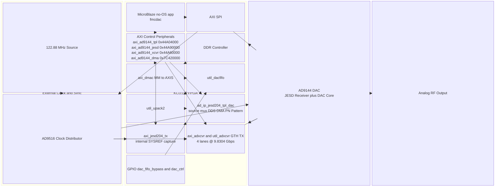
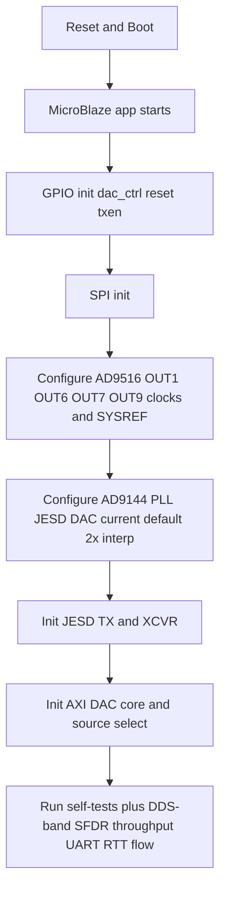
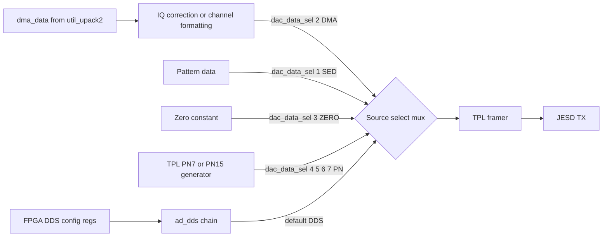
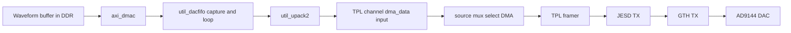
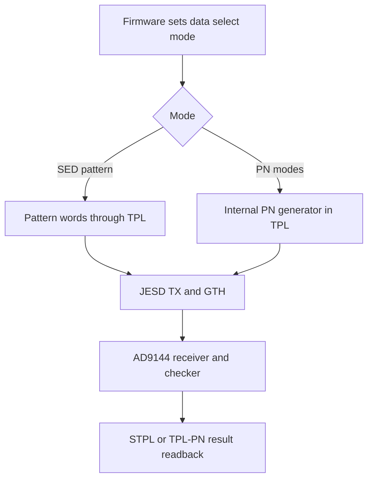
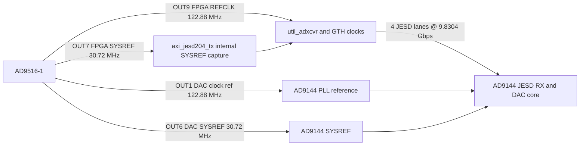

# System Block Diagram and Datapaths (Mermaid)

This document describes the implemented architecture in this repository:

- HDL: `hdl-adi-fork/projects/awg`
- Firmware: `no-OS-adi-fork/projects/fmcdac`
- Hardware target: KCU116 + AD9144 FMC DAC + AD9516 clocking

## 0) Framing: Current Baseline vs Target

- Current demonstrated / measured state: 2-channel JESD mode 4 operation; the present lab baseline is the current 250 MHz / 2-channel bring-up and benchmark state.
- Current default configuration: 4-lane GTH TX, 983.04 MSPS FPGA/JESD input, AD9144 2× interpolation enabled, 1966.08 MHz internal DAC clock, and AD9516 routing per `clock_architecture.md`:
  - OUT1 = DAC clock reference
  - OUT6 = DAC SYSREF
  - OUT7 = FPGA SYSREF
  - OUT9 = FPGA REFCLK
- Current Phase E HDL state: timestamped scheduler, software stream FIFO, DMA scheduler refill, SFP0 PG203 10G MAC, Ethernet RX DMA, and Ethernet TX DMA are implemented in HDL and routed timing-clean. Bitstream/XSA generation is blocked on the local PG203 license.
- Ultimate target capability: preserve the broader 10–450 MHz / quad-channel AWG framing. This document explains the current datapath and the hooks for later phases; it does not redefine the end goal downward.
- Open / later-phase options: Phase F firmware/runtime closure, DMA playback validation, AD9144 on-chip NCO placement, image-zone filtering, and true >491.52 MHz FPGA-generated bandwidth expansion remain distinct paths and should not be conflated with the current default DDS datapath.

--------------------------------------------------------------------------------

## 1) Full System Block Diagram (Structural, Not Flowchart)

--------------------------------------------------------------------------------

## 2) Firmware Control Flow

--------------------------------------------------------------------------------

## 3) TPL Source-Select Datapath

Key point:
- FPGA CORDIC is only in the DDS branch.
- DMA branch does not use FPGA CORDIC.
- AD9144 on-chip NCO, if enabled later, is downstream of the JESD receiver and is not the same block as the FPGA DDS/CORDIC chain.

--------------------------------------------------------------------------------

## 4) Datapath A: DDS/CORDIC Path (Current default benchmark path)

```mermaid
flowchart LR
  R[AXI writes DDS freq phase scale] --> REGMAP[ad_ip_jesd204_tpl_dac_regmap]
  REGMAP --> CH[ad_ip_jesd204_tpl_dac_channel]
  CH --> DDS[ad_dds]
  DDS --> DDS2[ad_dds_2]
  DDS2 --> DDS1[ad_dds_1]
  DDS1 --> CORDIC[ad_dds_sine_cordic]
  CORDIC --> MUXSEL[source mux default DDS]
  MUXSEL --> FR[TPL framer]
  FR --> JT[JESD TX]
  JT --> GTH[GTH TX]
  GTH --> DAC[AD9144 DAC]
```

--------------------------------------------------------------------------------

## 5) Datapath B: DMA Waveform Path (Present in hardware; not in current automated baseline)

Notes:
- `util_dacfifo` loops one captured segment using `dma_xfer_last`.
- `dac_fifo_bypass` selects FIFO mode vs bypass mode.
- This path exists in the hardware/source-mux architecture, but the current primary firmware and host benchmark flow do not exercise DMA playback yet.

--------------------------------------------------------------------------------

## 5A) Phase E Scheduler and Ethernet Producer Chain

```mermaid
flowchart LR
  HOST[Host UDP sender] --> SFP[SFP0 10G link]
  SFP --> MAC[eth_mac_10g PG203\n0x44C00000]
  MAC --> RXDMA[axi_eth_rx_dma\nAXIS to DDR\n0x44AC0000]
  RXDMA --> RAW[DDR raw frame buffers]
  RAW --> FW[MicroBlaze Phase F firmware\nvalidate frames and event ring]
  FW --> ERING[DDR event ring\n32 byte events]
  ERING --> SDMA[axi_sched_dma\nDDR to AXIS\n0x44AB0000]
  SDMA --> FIFO[awg_timed_ctrl stream FIFO\n511 usable events by default]
  FIFO --> SCHED[Timestamped scheduler\n0x44AA0000]
  SCHED --> TPLSCHED[Scheduled DDS control pins]
  TPLSCHED --> TPL[AD9144 TPL DDS controls]
```

Current HDL status:
- `awg_timed_ctrl_0` supports legacy preload, software stream pushes, and DMA
  stream ingress selected by `STREAM_CTRL[3]`.
- `axi_sched_dma` is memory-to-AXIS, 256-bit to 256-bit, non-cyclic, HP2.
- `axi_eth_rx_dma` is AXIS-to-memory, 64-bit to 256-bit, non-cyclic, HP3.
- `axi_eth_tx_dma` is memory-to-AXIS, 256-bit to 64-bit, non-cyclic, HP3.
- `eth_mac_10g` is PG203 `xxv_ethernet` v4.0 on SFP0 and is AXI-Lite polled.

Current firmware/runtime status:
- Phase F firmware is pending. The current no-OS `fmcdac` app has no scheduler
  DMA refill or Ethernet UDP transport modules yet.
- The Phase E HDL reached routed implementation with clean timing, but local
  bitstream/XSA generation is blocked until a full PG203 license is available.

--------------------------------------------------------------------------------

## 6) Datapath C: STPL and TPL PN Test Paths

Notes:
- These are TPL/data-path integrity tests, not the raw GTH PHY PRBS mode.
- The AD9144 PHY PRBS checker remains a separate, currently limited diagnostic because the TX-side raw PHY pattern source is not implemented in the present HDL.

--------------------------------------------------------------------------------

## 7) Optional AD9144 Internal NCO Overlay

This NCO is DAC-internal, not FPGA CORDIC.
It remains an opt-in diagnostic or later-phase placement aid; the current primary benchmark path is still FPGA DDS -> TPL -> JESD -> AD9144.

--------------------------------------------------------------------------------

## 8) Clock and SYSREF Flow

Notes:
- Current default runtime is 2× interpolation: FPGA/JESD input stays at 983.04 MSPS while the AD9144 internal DAC clock runs at 1966.08 MHz.
- 1× mode remains a valid comparison or fallback mode, but OUT1/OUT6/OUT7/OUT9 routing stays the same; only the AD9144 internal PLL/interpolation setting changes.

--------------------------------------------------------------------------------

## 9) Data-Select Mode Matrix

| Mode | Meaning | CORDIC involved |
|---|---|---|
| `AXI_DAC_DATA_SEL_DDS` | FPGA DDS synthesis path | Yes, if `DDS_TYPE=1` |
| `AXI_DAC_DATA_SEL_DMA` | DDR to DMAC streaming path | No |
| `AXI_DAC_DATA_SEL_SED` | Short pattern test path | No |
| `AXI_DAC_DATA_SEL_ZERO` | Zero output path | No |
| `AXI_DAC_DATA_SEL_PN*` | PN generator test path | No |

--------------------------------------------------------------------------------

## 10) Current Implementation Boundaries

Implemented and exercised in the current default baseline:
- DDS/CORDIC synthesis path.
- Source-select mux between DDS, DMA, pattern, PN, and zero.
- STPL and TPL PN validation paths.
- Subclass-1 bring-up with OUT1/OUT6/OUT7/OUT9 clocking and internal SYSREF capture in `axi_jesd204_tx`.

## 11) Scheduler marker probe point (deterministic commit marker)

- **Probe signal**: `marker_commit` top-level output from `projects/awg/kcu116/system_top.v`.
- **Physical pin**: `AF19` (`LVCMOS18`) in `projects/awg/kcu116/system_constr.xdc`.
- **Polarity / behavior**: **active-high pulse**, one `sched_clk` cycle wide, asserted in the scheduler `FIRE` state for each successfully fired event.
- **Measurement hookup**: connect oscilloscope/logic-analyzer tip to the routed marker pin and reference to board ground to timestamp commit edges versus SYSREF/SYNC events.

Implemented but not part of the current primary automated benchmark path:
- DMA waveform path through DMAC and util_dacfifo.
- Timestamped event scheduler with legacy preload, software stream mode, DMA
  stream ingress, low-watermark IRQ, empty-stall IRQ, EOF handling, and
  `marker_commit`.
- SFP0 10G Ethernet HDL datapath with PG203 MAC plus RX/TX DMAs.
- Optional AD9144 on-chip NCO control for later placement experiments.
- DMA playback or alternate-source experiments as a discriminator if DDS-band or SFDR evidence later requires them.

Blocked or later-phase architectural work:
- Phase F firmware/runtime closure for scheduler DMA refill and 10G UDP stream.
- PG203 licensed bitstream/XSA generation on the local tool installation.
- True >491.52 MHz FPGA-generated bandwidth expansion via a different JESD/HDL architecture; the current driver "mode 9" does not provide that capability.
- Hardware list and branch playback engine with deterministic branch latency.
- Atomic staged commit unit for time-tagged FTW/POW/ASF updates.
